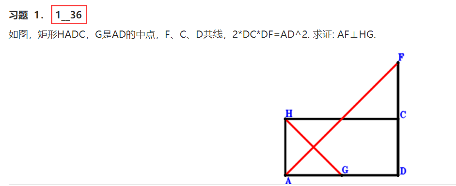

1.“old_exercises”文件夹存储原始习题。在浏览器中打开该文件夹下的“index.html”，可查看习题的详细信息。

2.“new_exercise”文件夹存储生成的新习题。在浏览器中打开该文件夹下“good.html”和“bad.html”，可分别查看质量好的习题和质量不好的习题。新习题编号后面的数字表示该习题对应的原始习题的编号。例如，下图中的“1_36”表示**新习题1**基于**原始习题1**和**原始习题36**的几何关系重组得到。
